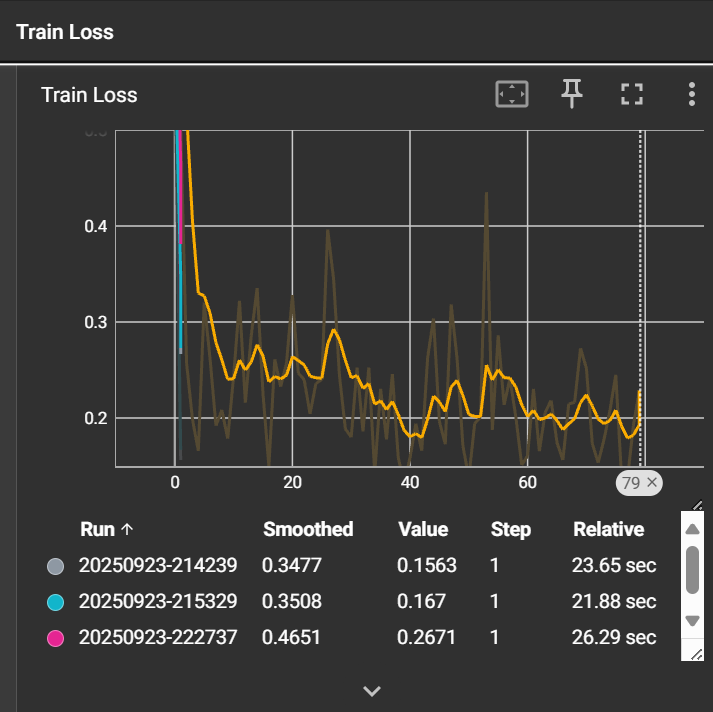

# 🔫 Gun Object Detection using Faster R-CNN
 
[](https://vimeo.com/1121617625)


🚀 End-to-end **Object Detection Project** to identify and localize guns in images using **PyTorch** and **Faster R-CNN**.
The project follows an **MLOps pipeline** with **DVC** for data & model versioning, **TensorBoard** for experiment tracking, and an **API** built with **FastAPI** for real-time inference.

---

## 📌 Project Overview

This project detects **guns in images** and draws bounding boxes around them.
It is built with a focus on **fine-tuning Faster R-CNN (ResNet-50 FPN backbone)** on custom gun images to detect and localize guns
and **integrate it into a custom MLOps pipeline** with DVC, TensorBoard, and FastAPI for reproducible training and scalable deployment.

**Key Highlights:**

* ✅ Custom training pipeline using **PyTorch**
* ✅ Experiment tracking with **TensorBoard**
* ✅ Data ingestion from **KaggleHub**
* ✅ Versioning datasets & models with **DVC** (Google Cloud bucket as remote)
* ✅ API for predictions built with **FastAPI**
* ✅ API tested with **Postman** and **SwaggerUI** (auto docs)
* ✅ **Bounding boxes** drawn on detected guns with **confidence scores**

---

## ⚙️ Tech Stack

* **Frameworks:** PyTorch, Torchvision
* **API:** FastAPI, SwaggerUI, Postman
* **Experiment Tracking:** TensorBoard
* **Version Control:** Git + DVC
* **Data Source:** KaggleHub
* **Cloud Storage:** GCP Bucket (for DVC remote storage)

---

## 🏗️ Project Pipeline

### 1️⃣ Data Ingestion

* Pulled dataset from **KaggleHub**.
* Structured into `artifacts/raw/`.

### 2️⃣ Training & Experiment Tracking

* Trained a **Faster R-CNN (ResNet-50 FPN backbone)** model on gun detection dataset.
* Used **TensorBoard** for monitoring training/validation loss.

### 3️⃣ DVC Integration

* ✅ **Initialized DVC** in the project.
* ✅ Defined stages in `dvc.yaml`:

  * `data_ingestion` → downloads data → saves in `artifacts/raw/`.
  * `model_training` → trains Faster R-CNN → saves weights to `artifacts/models/fasterrcnn.pth`.
* ✅ Managed heavy files (`artifacts/`, `logs/`, `tensorboard_logs/`) via `.gitignore`.
* ✅ Configured **Google Cloud Bucket** as DVC remote for model/data versioning.

### 4️⃣ Model Serving API

* Built a REST API with **FastAPI**.
* Endpoints:

  * `GET /` → Welcome message
  * `POST /predict/` → Upload an image, get predictions with bounding boxes drawn
* SwaggerUI available at `/docs` for easy testing.
* Used **Postman** to test and log API calls.

---

## 🖼️ How It Works

1. User uploads an image (via API, Swagger, or Postman).
2. Model processes the image using Faster R-CNN.
3. Returns the same image with **bounding boxes around detected guns**.

---
Perfect 👌 here’s a **concise “Metrics” section** you can drop into your README, plus a **short note on Faster R-CNN** (kept in your project context with MLOps focus):

---

### 📊 Metrics

* **Optimizer:** `Adam` with learning rate `1e-4`
* **Learning Rate Scheduler:** `StepLR` (step_size=10, gamma=0.1)
* **Training Loss:** sum of Faster R-CNN losses → `loss_classifier`, `loss_box_reg`, `loss_objectness`, `loss_rpn_box_reg`
* **Validation Loss:** same components, averaged across validation set
* **Experiment Tracking:** logged **batch-wise loss** and **epoch averages** to **TensorBoard**

**Latest Run:**

* Train Loss → `0.0314`
* Val Loss → `0.2350`
---
### 📉 Training Loss Curve (TensorBoard)



--

## 🚀 Running the Project

### 1. Clone Repository

```bash
git clone https://github.com/your-username/GunObjectDetection.git
cd GunObjectDetection
```

### 2. Install Dependencies

```bash
pip install -r requirements.txt
```

### 3. Reproduce Pipeline with DVC

```bash
dvc pull   # fetches data & models from GCP bucket
dvc repro  # runs pipeline stages
```

### 4. Train Model

```bash
python model_training.py
```

### 5. Run API

```bash
uvicorn app:app --reload
```

### 6. Test API

* **SwaggerUI:** `http://127.0.0.1:8000/docs`
* **Postman:** Send `POST /predict/` with `file` as an uploaded image.

---

## 📊 Experiment Tracking

* **TensorBoard**:

```bash
tensorboard --logdir=tensorboard_logs
```

* View training/validation loss curves.

---

## ☁️ DVC + GCP Setup

* Configured **Google Cloud Storage bucket** as remote for DVC.
* Authenticated with service account JSON key using:

```bash
export GOOGLE_APPLICATION_CREDENTIALS="path/to/key.json"
```

* Push data & models:

```bash
dvc push
```

---

## 🔮 Future Work

* Extend dataset for **multi-class detection** (e.g., guns, knives, dangerous objects).
* Deploy API to **Render / GCP Cloud Run / AWS Lambda**.
* Integrate **CI/CD** with GitHub Actions for automated training & deployment.

